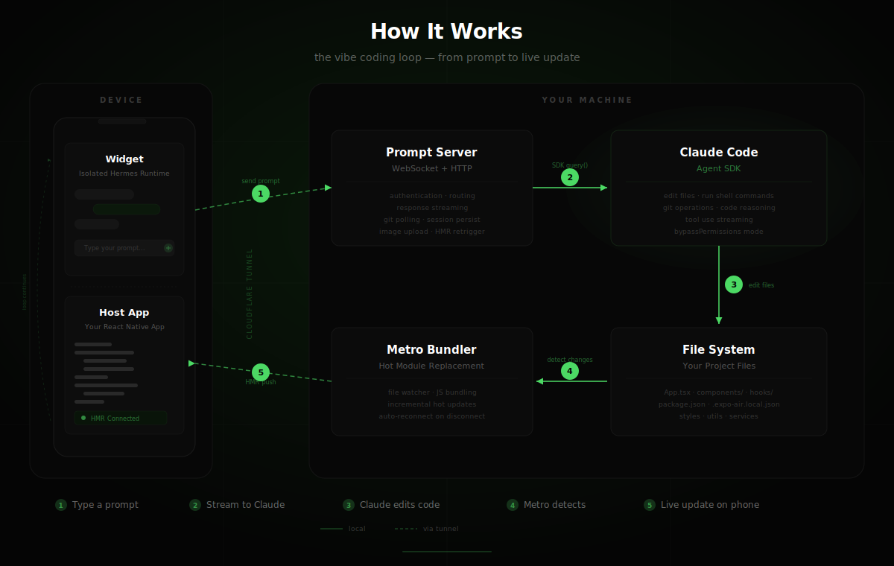

<p align="center">
  
</p>

```bash
npx expo-air init
```

Connect your device

```bash
npx expo-air fly
```

Boom. You can work from anywhere.

## How It Works

<p align="center">
  
</p>

expo-air creates a real-time feedback loop between your phone and Claude Code.
A floating chat widget — running in its own isolated Hermes runtime — overlays your app
and connects via Cloudflare tunnels to a prompt server on your machine.

When you send a message, Claude edits your project files directly,
Metro picks up the changes, and HMR pushes them to your device instantly.
The whole loop takes seconds.

[See original tweet](https://x.com/SerfatyGuy/status/2021233783769338031) · [Read the docs](https://expo-air.10play.dev/)
